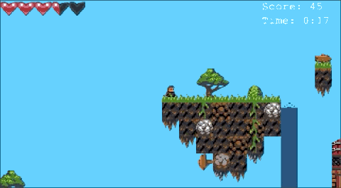
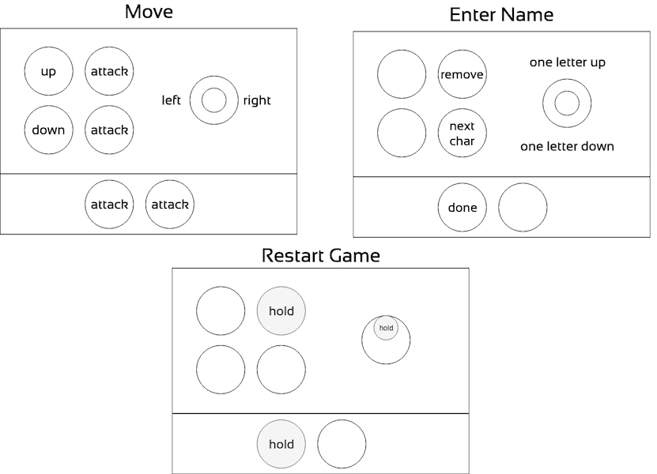
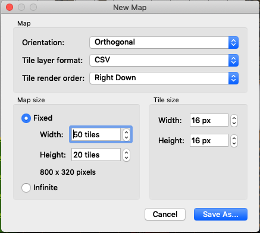
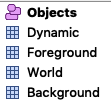
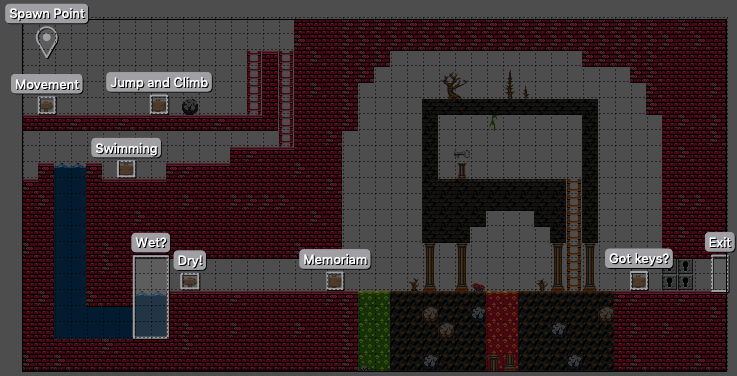

# Sandstorm Quest

_Sandstorm Quest_ is a little jump-and-run game.
You have to kill monsters by shooting them down
 and collect coins and other items to get points.
Most of them are hidden somewhere secret – have fun searching.



The game has been created as part of a [internship of two pupils](https://sandstorm.de/de/blog/post/schuelerprakticom-bei-sandstorm.html)
  and then presented on the [Neos Conference 2019](https://www.neoscon.io/).
Programming new monsters, designing new levels and figuring out a score-system has been a fun and challenging internship task.

[__You can play it here.__](https://sandstorm.de/de/blog/post/schuelerprakticom-bei-sandstorm.html)

Or you can use this project as a blueprint or _Getting Started Guide_ for your own project
  … or create a _Pull Request_.

# Controls

## Keyboard

Use the _Arrow–Keys_ to run, jump, climb and swim.
Shoot a bolt with _Space_.

## Game Pad

We added support for a Retro Pie Controller for the Neos Conference.



# Development

The games is based on [Phaser3](https://phaser.io/phaser3)
  and written in _ECMAScript 6_.
In order to get started,
  read the tutorials linked in _Preliminaries_.

## Preliminaries

You should be familiar with _JavaScript_.
To get to know _Phaser3_ we recommend the following tutorials/links (in this order).

1. [Making your first Game](https://phaser.io/tutorials/making-your-first-phaser-3-game)
1. [Modular Game Worlds in Phaser 3](https://medium.com/@michaelwesthadley/modular-game-worlds-in-phaser-3-tilemaps-1-958fc7e6bbd6)
1. [Phaser3: Multiple Scenes](https://labs.phaser.io/edit.html?src=src%5Cscenes%5Cui%20scene%20es6.js)
1. [The Complete Guide to Debugging Phaser Games](https://gamedevacademy.org/how-to-debug-phaser-games/)
1. [Phaser3 Examples](http://labs.phaser.io/)
1. [Phaser3 API Docs](https://photonstorm.github.io/phaser3-docs/)

## Even more Links

This [Retro Highscore Table](http://phaser.io/tutorials/retro-highscore-table/index) got our attention
  but we skipped it due to lack of time.

We got the tile set is from
[OpenGameArt.Org: Collection of the best Tilesets](https://opengameart.org/content/best-orthogonal-rectangular-tilesets-for-tilemaps)
and decided for this one:
[Simple broad-purpose Tileset](https://opengameart.org/content/simple-broad-purpose-tileset)
.

## Editors

As a level editor we use [Tiled: the map editor](https://www.mapeditor.org/) (for *.tmx, *.tsx).

For programming you can use your favorite text editor or check out [Visual Studio Code](https://code.visualstudio.com/download).

## Local Start

Currently `yarn parcel:build` (see below) does not work yet.
Just start a local web-server in the project directory, e.g. with `php -S localhost:8080`.

You need a modern browser which supports JavaScript Modules!

## Bundling

You need to install the [Node Version Manager](https://github.com/nvm-sh/nvm#installation-and-update).

```sh
nvm install && \
  npm install -g yarn && \
  yarn && \
  yarn parcel:build
```

## Creating a new Level

1. Download and install [Tiled: the map editor](https://www.mapeditor.org/).
1. Open the tileset [assets/simples_pimples.tsx](./assets/simples_pimples.tsx).
1. Create a new map and take care of the _tile rendering order_ and the _tile size_.  

1. Add three _tile layers_ and one _object layer_
    * _Objects_ for invisible objects controlling the behavior of the world
    * _Dynamic_ for collectable items and monsters
    * _Foreground_ for untouchable tiles in front of the player
    * _World_ for touchable tiles (solid, harmful, liquid, non-solid, …)
    * _Background_ for untouchable tiles behind the player  

1. Draw you level and include a _Spawn Point_  

1. Export as _.json_
1. Fetch the _.json_ file in _function preload()_ in [src/levelScene.js](./src/levelScene.js)
1. Make level reachable from _Exit_ of another level or set as start level

### Supported Objects

Object behavior is implemented in [src/objectHandling.js](./src/objectHandling.js).

#### Spawn Point

The player spwans at _(x, y)_ of the Object named _Spwan Point_.

#### Messages

If the player is inside a rectangle with a custom property _message_
  then this message is shown to the user.
The name of the object does not matter.

#### Next Level

If the player enter a rectangle with a custom property _nextLevel_
  then the player respawns in the given level.
The name of the object does not matter.

#### Start of Game

If the player enters a rectangle named _Start of Game_
  then the game restarts, setting the score and timer to _0_.
When the player leaves the _Start of Game_ the timer starts.

#### End of Game

Of the player enters a rectangle named _End of Game_
  then the timer stops and the high-score board appears.

### Supported Items

Some tiles in the tile set contain custom properties like _heals_ and _pays_.
If the player collects such items from the _Dynamic_ tile layer
  then something happens.
Keys open the respective locks for the player and monsters.

Item behavior is implemented in [src/dynamicsHandling.js](./src/dynamicsHandling.js).

# Licenses

See [github.com/photonstorm/phaser](https://github.com/photonstorm/phaser),
  [Simple broad-purpose Tileset](https://opengameart.org/content/simple-broad-purpose-tileset)
  and [LICENSE](./LICENSE).

# Open TODOs

Here are some ideas how to improve the game.
There is no schedule though or active development currently.

* [ ] keyboard support for high-score (currently only game pad)
* [ ] score bonus for time
* [ ] animate more stuff 
    * [ ] lava
    * [ ] acid
    * [ ] liquid surface
    * [ ] running monsters
* [ ] Full-Screen mode
* [ ] Monsters
    * [ ] should not jump over holes too wide to jump over
    * [ ] should die/despawn when falling out of level
    * [ ] should despawn when dead?!
    * [ ] add more monsters (and some with new behavior)
* [ ] scripted world
    * [ ] Traps with respawn aka ambush (special invisible objects triggered by player proximity)
    * [ ] Surprises from chests
* [ ] Potions
    * [ ] Potion of inverse gravity
    * [ ] Potion of acid/fire/spike walk (?)
    * [ ] Potion of invisibility
    * [ ] Poisoning
    * [ ] Potion of poison
    * [ ] Potion of drunkenness
    * [ ] Potion of speed/giantism/dwarfism
    * [ ] Potion of fire power
* [ ] go Mobile
    * [ ] Cordova packaging
    * [ ] Controls on HUD
